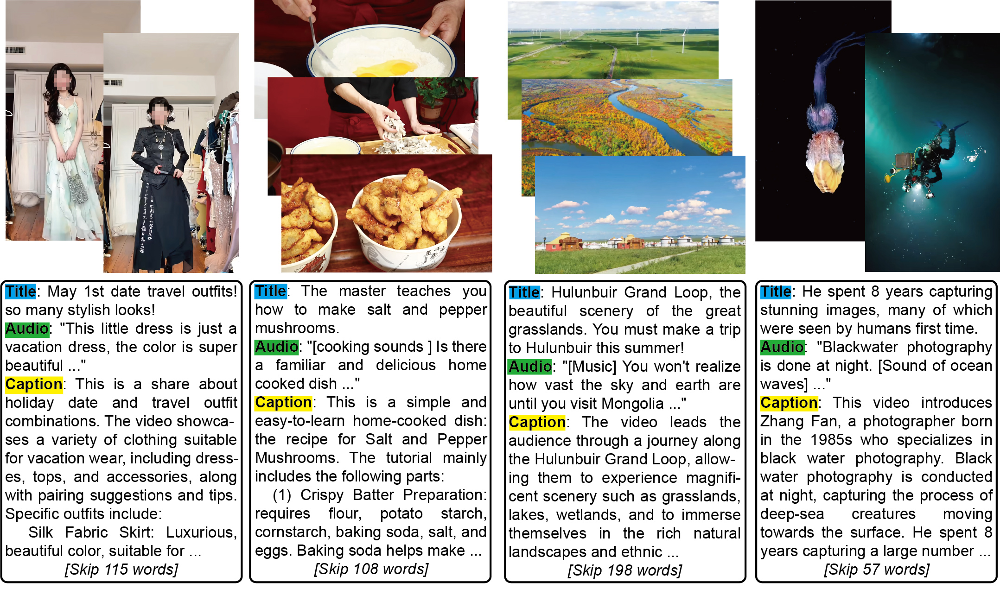
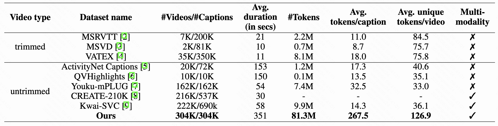

<h2 align="center"> DEPICT: Towards Holistic Long Video-Language Understanding</a></h2>
<!-- <h2 align="center"> <a href="https://arxiv.org/abs/2311.10122">DEPICT: Towards Holistic Long Video-Language Understanding</a></h2> -->

<p align="center">
  
</p>


## About DEPICT dataset
From paper "DEPICT: Towards Holistic Long Video-Language Understanding" (Under review)

In this work, we curate the DEPICT dataset, a high-quality large-scale video caption dataset of untrimmed videos, consisting of 304K videos and 81.3M caption tokens. 
It has richer annotations than existing video caption datasets, including 8x more caption tokens, 2x more average unique tokens/video, and more modalities.

<p align="center">
  
</p>

## Download

We provide two downloading approach:
- [Google drive](https://drive.google.com/drive/folders/1kBc5yElL-3S6urEJ0GcbcjIpzv2f-VJ2?usp=sharing)
- [Baidu drive](https://pan.baidu.com/s/19ral05qqQK2pKVjo6po-tw?pwd=yq77) (code: 759q)


Unzip the files to forge the following directories:
```
data
└── depict
    └── annotations
        └── train.json
        └── val.json
        └── test.json
    └── videos
```


## Visualization

We provide code for dataset visualization in `./visualization.ipynb`. 

If the video is unplayable in the Jupyter notebook above, you may be missing the hevc/H.265 codec. Install it or convert videos to the H.264 codec for proper visualization. Please note that this issue will not affect the baseline codes, as both video decoding package `pyav` and `decord` can handle this.

## Baselines
We provide instructions to run the baselines in the paper to reproduce all experiments including ablation studies:
- [MovieChat](docs/MovieChat.md)
- [LLaMA-VID](docs/LLaMA_VID.md)
- [Video-LLaVA](docs/Video_LLaVA.md)
- [VideoChat2](docs/Videochat2.md)
- [LLaVA-NeXT](docs/LLaVA_NEXT.md)

After finishing inference, run `evaluation.py` to get evluation results.

## Annotation format
The annotations are organized in a nested manner shown below:

```json
[
  {
    "BVid": "BV1hT421X7xV",
    "video_duration": 158,
    "video_title": "Both a Home-cooked Dish and a Street-side Specialty Snack, Master teaches you how to make Salt and Pepper Mushrooms",
    "summarization": "This is a simple and easy-to-learn home-cooked dish - the recipe for Salt and Pepper Mushrooms, suitable for selling at a stall ...",
    "asr_results": "Do we have a familiar and delicious home-cooked dish that can be made into a street snack, light and swift to set up a stall ..."
  },
  ...
]
```